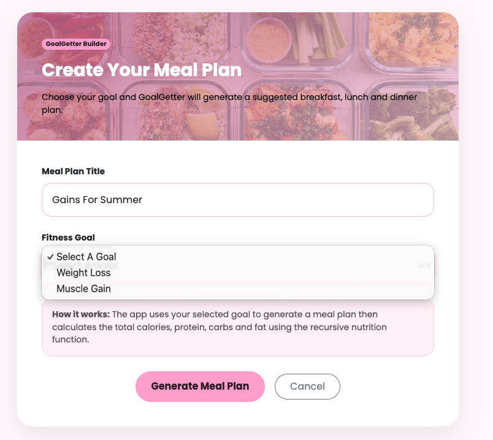
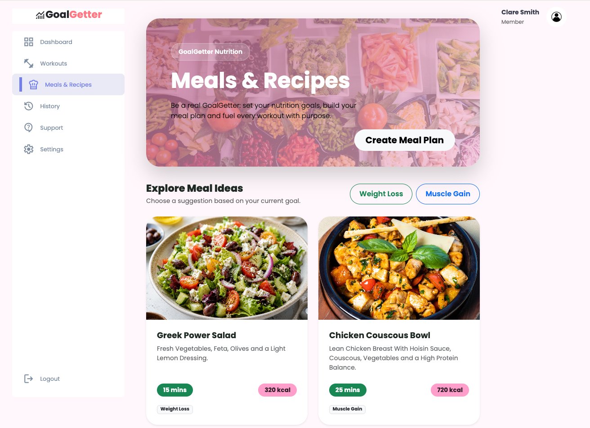
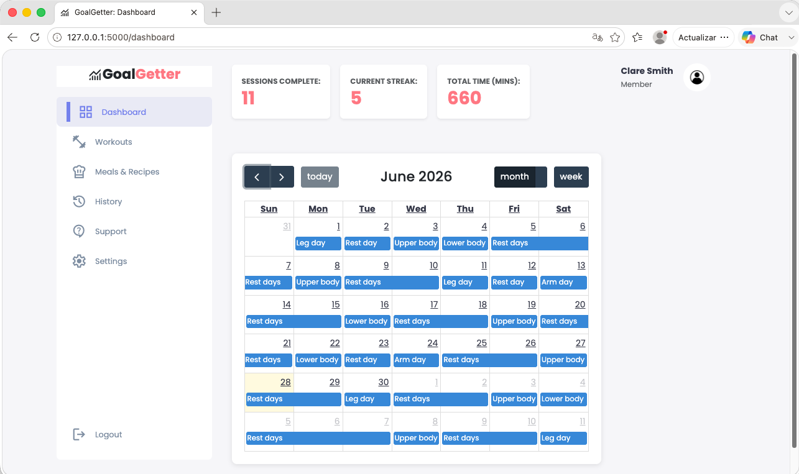

# GoalGetter Fitness Tracker - ReadME (Setup and Run Guide)

## Project Overview

GoalGetter is a fitness tracking application designed to help users monitor their fitness journey
Users can log workouts, track exercises, record meals and set personal fitness goals
The application aims to provide a simple and organised way to manage health and fitness progress

## Technologies used

- Python
- Flask
- MySQL
- DBeaver
- Git/GitHub
- ExerciseDB API

### Group Members

- Tosin
- Shalesa
- Lana
- Adeyosola
- Neha
- Thelma

## Features

- Create and manage a user profile
- Log workouts and track exercise activity
- Search for exercises using ExerciseDB
- Set and moitor fitness goals
  Track meals and calories intake
- View workout history
- Store fitness data for future reference

## Prerequisites

Before running this project, ensure the following software is installed:

- Python 3.11 or later
- MySQL Server
- DBeaver (or another MySQL client)
- Git
- pip (Python package manager)

## Clone the Repository

Clone the repository and navigate into the project folder.

```python
git clone https://github.com/Tosino97/CFG-Group-Project.git
```

## Install Dependencies

Install the required Python packages:

```python
pip install -r requirements.txt
```

If you don't already have python-dotenv installed, run:

```python
pip install python-dotenv
```

## Database Setup

1. Install MySQL and DBeaver.
2. Open DBeaver and connect to your local MySQL server.
3. Open `goalgetter_schema.sql`.
4. Execute the script to create the GoalGetter database and tables.
5. Open `sample_data.sql`.
6. Execute the script to populate the database with sample records.
7. Refresh the database navigator to confirm that all tables have been created successfully

## ExerciseDB API Setup

The Exercise Search feature uses ExerciseDB API hosted on RapidAPI. A personal RapidAPI key is required to access this functionality.

### 1. Create a RapidAPI Account.

Visit: https://rapidapi.com/ascendapi/api/edb-with-videos-and-images-by-ascendapi

1. Create a free RapidAPI account or sign in if you already have an account.
2. Subscribe to the Free plan (or another plan if you prefer another subscription).

### 2. Obtain your API Key

After subscribing: 

1. Click on MCP Playground to locate the API key 
2. Open the App section of the API page.
3. Locate your X-RapidAPI-Key (this must be kept a secret). 
4. Copy the key. 

### 3. Create a `.env` File

Create a `.env` file in the root project directory.

Add your RapidAPI key replacing the placeholder:

`RAPIDAPI_KEY=your_rapidapi_key_here`

Example:

`RAPIDAPI_KEY=1234567890abcdefghijklmnopqrstuvwxyz`

Required environment variable: `RAPIDAPI_KEY` (*store this in your .env file*)

The `.env` file should not be committed to GitHub and should be listed in `.gitignore`.

### API Documentation

For the most up-to-date API endpoints and documentation, refer to the official AscendAPI documentation:

<https://docs.ascendapi.com/>

To use the API in this project, subscribe to the API through RapidAPI to obtain your API key.

## Running the application 

### Start MySQL

### Run `python app.py`

From the project root directory, run:
`python app.py`

### Open the Flask URL

The Flask development server should start and display something similar to:

```python
Running on http://127.0.0.1:5000
```

Open the URL in your browser.

## Using the application

### API Endpoints

- Search by body part
- Search by equipment
- Search by target muscle
- Search by exercise name
- Search by exercise type

### Manage workouts (Thelma)

## Workout Management (CRUD)

This application manages workouts using full CRUD Flask routes.

- Users can create, read, update, and delete workouts.
- These routes handle user requests, interact with the database, and ensure workout data is properly stored and managed.

## Workout History Endpoint

The application includes a workout history endpoint that retrieves all past workouts for a specific user.  
This allows users to track their fitness journey, including workout dates, duration, and calories burned.

### Example Route

```python
@app.route("/workouts/user/past_workouts/<user_id>", methods=["GET"])
def get_workout_user_api(user_id):
        try:
            user_id = int(user_id)
        except ValueError:
            return jsonify({"status": "Error", "message": "Invalid user ID"}), 400
        try:
            workout = get_workouts_by_user_id(user_id)

            if not workout:
                return jsonify({"status": "error", "message": "Workout not found"}), 404

            return jsonify({"status": "Workout found", "data": workout}), 200

        except Exception as e:
                return jsonify({
                "status": "error",
                "message": "Failed to retrieve workout",
                "error": str(e)
                }), 500

        except Exception as e:
            return jsonify({
            "status": "error",
            "message": "Failed to retrieve workout",
            "error": str(e)
            }), 500

```

### Example Request

```
GET /workouts/user/past_workouts/1
```

### Example Response

```json
{
  "id": 1,
  "user_id": 1,
  "workout_date": "2026-06-20",
  "duration_minutes": 60,
  "calories_burned": 500
}
```

### Screenshot


### Search exercises

The application integrates with ExerciseDB API to search for exercises.

Example routes:

Search by body part:

`http://127.0.0.1:5000/exercises?body_part=CHEST`

Search by equipment:

`http://127.0.0.1:5000/exercises?equipment=DUMBBELL`

Search by target muscle:

`http://127.0.0.1:5000/exercises?muscle=QUADRICEPS`

Search by exercise name:

`http://127.0.0.1:5000/exercises?name=bench`

Search by exercise type:

`http://127.0.0.1:5000/exercises?exercise_type=STRENGTH`

The application displays exercise cards showing:

- Exercise name
- Exercise type
- Body part
- Target muscle
- Equipment
- Exercise image

### Register/ login (Shalesa)

### Manage workouts (Thelma)

- This application manages workouts using the full CRUD flask routes.
- Can create, read, update and delete workouts. These routes handle user requests, interact with the database and ensure workout data can be managed through this application.
- The application has a workout history endpoint where users can receive all past workouts. This allows the user to see their fitness journey details and progress such as when the user worked out and burned the most calories.

This image below shows you an example of the exercise cards:


## Create Meal Plans (Yosola)

The meal planning feature allows users to create a personalised meal plan based on their fitness goal. Users can choose between a weight loss goal and a muscle gain goal. Once a goal is selected, the application generates a suggested meal plan and displays the total calories, protein, carbohydrates and fat.

The feature also includes a seven day meal plan view. This uses a recursive function to generate weekly meal plan variations from the selected base meal plan.

### Files Used

#### Backend

`models/meal.py`  
Contains the `Meal` and `MealPlan` classes, the recursive nutrition calculation function, the goal based meal suggestion function and the recursive weekly meal plan variation function.

`routes/meal_routes.py`  
Contains the Flask routes for viewing meal plans, creating a meal plan, updating a meal plan, deleting a meal plan and viewing the seven day meal plan.

#### Frontend

`templates/meals/list.html`  
Displays the meal plan gallery and goal based meal suggestions.

`templates/meals/create.html`  
Displays the form used to create a new meal plan.

`templates/meals/detail.html`  
Displays the generated meal plan, nutrition totals and action buttons.

`templates/meals/update.html`  
Displays the form used to update an existing meal plan.

`templates/meals/weekly.html`  
Displays the seven day meal plan variations.

#### Unit Test

`tests/test_meal_models.py`  
Contains unit tests for the meal planning models, recursive nutrition calculation, goal based suggestions and weekly meal plan variations.

### Running the Meal Planning Feature

Start the Flask application from the root project directory:

```bash
python app.py
```

The Flask server should display a local URL such as:

```text
http://127.0.0.1:5000
```

To open the meal planning page directly, go to:

```text
http://127.0.0.1:5000/meal-plans/
```

If the application is running on port `5001` instead, use:

```text
http://127.0.0.1:5001/meal-plans/
```

### Using the Meal Planning Feature

From the meal plans page, users can view the available meal ideas and select goal based meal plan suggestions.

To create a new meal plan:

1. Click **Create Meal Plan**.
2. Enter a meal plan title.
3. Select either **Weight Loss** or **Muscle Gain**.
4. Click **Generate Meal Plan**.
5. The application will display the generated meal plan with nutrition totals.

After creating a meal plan, users can:

- View the generated meal plan
- Update the meal plan title or goal
- Delete the meal plan
- View a seven day meal plan generated from the selected plan

### Example Meal Plan Routes

View all meal plans:

```text
http://127.0.0.1:5000/meal-plans/
```

Create a meal plan:

```text
http://127.0.0.1:5000/meal-plans/create
```

View a suggested weight loss plan:

```text
http://127.0.0.1:5000/meal-plans/suggest/weight_loss
```

View a suggested muscle gain plan:

```text
http://127.0.0.1:5000/meal-plans/suggest/muscle_gain
```

### Running Meal Planning Unit Tests

To run the meal planning unit tests from the root project directory, use:

```bash
python -m unittest discover -s tests -p "test_meal_models.py" -v
```

If successful, the output should show:

```text
Ran 5 tests
OK
```

### Notes

The meal planning feature currently uses predefined meal suggestions to generate plans for weight loss and muscle gain. Created meal plans are managed through the Flask application routes and can be created, viewed, updated and deleted during the running session.

### Screenshots



### 📊 Dashboard/ progress (Neha)

***Note*** *The dashboard currently uses sample data to demostrate the user interface. Integration with live backend data is planned for future development*

#### Frontend & Backend Setup

This section covers the implementation of the dashboard and calendar components of the application.

The image below shows a preview of the main user dashboard interface, featuring the weekly workout calendar and data analytics widgets:

#### 🗂️ Files Implemented

##### Frontend:

- `frontend.py` - Flask frontend routes using mocked data for UI demonstration.
- `frontend_blueprinting.py` - Initial Flask Blueprint implementation to support modular routing.
- `layout.html` - Base HTML template providing global structure and sidebar navigation.
- `dashboard.html` - Dashboard interface featuring widget statistics, and a Calendar UI
- `workouts.html` - Workouts page with dropdown filtering to display mock data
- `meals_and_recipes.html` - Recipe interface displaying mock API response cards
- `history.html` - Past history user workout data rendered in a structured table
- `settings.html` - User settings interface implementation
- `support.html` - Support form allowing users to submit issues or bugs reports.
- `logout.html` - Logout route and interface element.

##### Backend:

- `dashboard_logic.py` - Dashboard widget calculation logic.
- `calendar_logic.py` - Calendar scheduling logic using a Breadth First Search (BFS) implementation.

##### Unit Test:

- `test_dashboard_logic.py` - Unit tests for dashboard calculation logic
- `test_calendar_logic.py` - Unit tests for calendar scheduling logic

##### Running the frontend UI application:

- Install project dependencies
- Run the Flask application (e.g. `python frontend.py`)
- Open the application in a web browser
- Navigate using the sidebar to access dashboard, calendar, workouts, meals, history, settings, and support pages

##### Notes:

- The frontend demonstrates a Minimum Viable Product (MVP) using mocked data for demonstration purposes.
- Dashboard widget values and calendar events are also powered by mock data to demonstrate frontend functionality.
- Unit tests are provided for the dashboard and calendar backend modules to verify the isolated logic of both components.

## Running Unit Tests

Run all project tests from the root project directory:

```python
python -m unittest discover -s tests
```

If successful, the output should look something like:

```python

Ran X tests in 0.XXXs

OK
```

## Troubleshooting

### Database connection fails

### Exercise API returns an authentication error

- Confirm that a valid `RAPIDAPI_KEY` has been added to the `.env` file
- Restart the Flask application after updating the `.env` file

## Future Improvements

- Progress charts and analytics
- Improved meal planning features
- Additional fitness APIs
- Mobile application support
